# 📋 Plano de Implementação: Sistema de Templates para Onboarding

## 🎯 Objetivo
Criar um sistema de onboarding interativo onde novos usuários são direcionados para templates de projetos pré-configurados com sandbox populado e chat mockado, permitindo continuação real da conversa.

## 🏗️ Arquitetura do Sistema

### Fluxo Completo

```mermaid
graph TD
    A[Usuário Novo] --> B[WelcomeAnnouncement]
    B --> C[Escolhe Caso de Uso]
    C --> D[Backend: setup-template]
    D --> E[Cria Projeto]
    E --> F[Ativa Sandbox]
    F --> G[Popula Arquivos]
    G --> H[Cria Thread]
    H --> I[Adiciona Mensagens Mock]
    I --> J[Redireciona para Chat]
    J --> K[Usuário Continua Interação]
```


## 📁 Estrutura de Arquivos

### Frontend
```
frontend/src/
├── components/onboarding/
│   ├── WelcomeAnnouncement.tsx       # [MODIFICAR] Adicionar seletor de template
│   ├── TemplateSelector.tsx          # [CRIAR] Componente de seleção
│   └── OnboardingService.ts          # [CRIAR] Serviço de setup
├── lib/
│   ├── api.ts                        # [MODIFICAR] Adicionar função setupTemplate
│   └── templates/                    # [CRIAR] Definições de templates
│       └── index.ts
└── hooks/
    └── use-onboarding-store.ts        # [MODIFICAR] Adicionar selectedTemplate
```

### Backend
```
backend/
├── api.py                             # [MODIFICAR] Adicionar rota setup-template
├── services/
│   └── template_service.py           # [CRIAR] Lógica de templates
├── templates/                         # [CRIAR] Definições de templates
│   ├── __init__.py
│   ├── portfolio.py
│   ├── automation.py
│   └── data_analysis.py
└── agent/tools/
    └── sb_files_tool.py              # [USAR] Para criar arquivos no sandbox
```

## 🔄 APIs e Rotas

### 1. Nova Rota Backend
```python
# backend/api.py
@app.post("/api/onboarding/setup-template")
async def setup_template(
    request: SetupTemplateRequest,
    user_id: str = Depends(get_current_user_id_from_jwt),
    db: DBConnection = Depends(get_db)
) -> SetupTemplateResponse:
    """
    Cria projeto com template, popula sandbox e retorna IDs
    """
```

#### Request Model
```python
class SetupTemplateRequest(BaseModel):
    template_name: str  # "portfolio" | "automation" | "data_analysis" | "api"
    user_preferences: dict = {}  # Preferências opcionais do onboarding
```

#### Response Model
```python
class SetupTemplateResponse(BaseModel):
    project_id: str
    thread_id: str
    sandbox_id: str
    sandbox_url: str
    initial_messages: List[Message]
```

### 2. Função Frontend
```typescript
// frontend/src/lib/api.ts
export const setupTemplate = async (
  templateName: string,
  userPreferences?: Record<string, any>
): Promise<{
  projectId: string;
  threadId: string;
  sandboxId: string;
  sandboxUrl: string;
  initialMessages: Message[];
}> => {
  const response = await fetch(`${API_URL}/api/onboarding/setup-template`, {
    method: 'POST',
    headers: {
      'Content-Type': 'application/json',
      'Authorization': `Bearer ${token}`
    },
    body: JSON.stringify({
      template_name: templateName,
      user_preferences: userPreferences
    })
  });
  
  return response.json();
};
```

## 📝 Templates Definidos

### Estrutura de um Template
```python
# backend/templates/portfolio.py
PORTFOLIO_TEMPLATE = {
    "name": "Portfolio Profissional",
    "description": "Site portfolio moderno com seções de projetos e contato",
    "icon": "🎨",
    
    "files": [
        {
            "path": "index.html",
            "content": """<!DOCTYPE html>
<html lang="pt-BR">
<head>
    <meta charset="UTF-8">
    <meta name="viewport" content="width=device-width, initial-scale=1.0">
    <title>Meu Portfolio</title>
    <link rel="stylesheet" href="styles.css">
</head>
<body>
    <header>
        <nav>
            <ul>
                <li><a href="#sobre">Sobre</a></li>
                <li><a href="#projetos">Projetos</a></li>
                <li><a href="#contato">Contato</a></li>
            </ul>
        </nav>
    </header>
    
    <section id="hero">
        <h1>João Silva</h1>
        <p>Desenvolvedor Full Stack</p>
    </section>
    
    <section id="sobre">
        <h2>Sobre Mim</h2>
        <p>Apaixonado por tecnologia e inovação...</p>
    </section>
    
    <section id="projetos">
        <h2>Projetos</h2>
        <div class="project-grid">
            <!-- Projetos serão adicionados aqui -->
        </div>
    </section>
    
    <section id="contato">
        <h2>Contato</h2>
        <form>
            <input type="email" placeholder="Seu email">
            <textarea placeholder="Mensagem"></textarea>
            <button type="submit">Enviar</button>
        </form>
    </section>
</body>
</html>"""
        },
        {
            "path": "styles.css",
            "content": """* {
    margin: 0;
    padding: 0;
    box-sizing: border-box;
}

body {
    font-family: 'Inter', -apple-system, sans-serif;
    line-height: 1.6;
    color: #333;
}

header {
    background: #fff;
    box-shadow: 0 2px 5px rgba(0,0,0,0.1);
    position: fixed;
    width: 100%;
    top: 0;
    z-index: 1000;
}

nav ul {
    display: flex;
    list-style: none;
    padding: 1rem 2rem;
    gap: 2rem;
}

nav a {
    color: #333;
    text-decoration: none;
    font-weight: 500;
}

#hero {
    min-height: 100vh;
    display: flex;
    flex-direction: column;
    justify-content: center;
    align-items: center;
    background: linear-gradient(135deg, #667eea 0%, #764ba2 100%);
    color: white;
}

#hero h1 {
    font-size: 3rem;
    margin-bottom: 1rem;
}

section {
    padding: 4rem 2rem;
    max-width: 1200px;
    margin: 0 auto;
}

.project-grid {
    display: grid;
    grid-template-columns: repeat(auto-fit, minmax(300px, 1fr));
    gap: 2rem;
    margin-top: 2rem;
}"""
        }
    ],
    
    "messages": [
        {
            "type": "human",
            "content": "Crie um site portfolio moderno e responsivo com seções para sobre mim, projetos e contato. Use um design limpo e profissional.",
            "timestamp_offset": -300  # 5 minutos atrás
        },
        {
            "type": "assistant",
            "content": "Vou criar um site portfolio moderno para você! Começarei com a estrutura HTML e estilos CSS profissionais.",
            "timestamp_offset": -280
        },
        {
            "type": "assistant",
            "content": "<function_calls><invoke name=\"create-file\"><parameter name=\"path\">index.html</parameter></invoke></function_calls>",
            "timestamp_offset": -260
        },
        {
            "type": "assistant",
            "content": "<function_calls><invoke name=\"create-file\"><parameter name=\"path\">styles.css</parameter></invoke></function_calls>",
            "timestamp_offset": -240
        },
        {
            "type": "assistant",
            "content": "Perfeito! Criei a estrutura base do seu portfolio com:\n\n✅ **Header fixo** com navegação suave\n✅ **Hero section** com gradiente atrativo\n✅ **Seções organizadas** para Sobre, Projetos e Contato\n✅ **Design responsivo** que funciona em todos dispositivos\n✅ **Formulário de contato** funcional\n\nO site está pronto! Você pode personalizá-lo alterando:\n- Seu nome e título no hero\n- Texto da seção \"Sobre\"\n- Adicionar seus projetos reais\n- Cores do gradiente no CSS\n\nQuer que eu adicione alguma funcionalidade específica, como animações, modo escuro ou integração com suas redes sociais?",
            "timestamp_offset": -200
        }
    ],
    
    "next_suggestions": [
        "Adicione um modo escuro ao site",
        "Integre com GitHub para mostrar repositórios automaticamente",
        "Adicione animações suaves ao fazer scroll",
        "Crie uma seção de habilidades com barras de progresso"
    ]
}
```

### Templates Disponíveis

1. **Portfolio** (`portfolio`)
   - Site portfolio com HTML/CSS
   - Seções: Hero, Sobre, Projetos, Contato
   - Pronto para personalização

2. **Automação de E-mail** (`email_automation`)
   - Script Python para automação
   - Configuração de Gmail API
   - Template de e-mail

3. **Análise de Dados** (`data_analysis`)
   - Jupyter notebook inicial
   - Dataset de exemplo
   - Visualizações básicas

4. **API REST** (`rest_api`)
   - Servidor Express.js
   - Rotas CRUD básicas
   - Documentação Swagger

## 🔧 Implementação Backend Detalhada

### Template Service
```python
# backend/services/template_service.py
import asyncio
from typing import Dict, List, Optional
from datetime import datetime, timedelta
import json

from services.supabase import DBConnection
from agent.tools.sb_files_tool import SandboxFilesTool
from templates import TEMPLATES

class TemplateService:
    def __init__(self, db: DBConnection, user_id: str):
        self.db = db
        self.user_id = user_id
        self.sandbox_tool = SandboxFilesTool()
    
    async def setup_template(
        self, 
        template_name: str, 
        user_preferences: Optional[Dict] = None
    ) -> Dict:
        """
        Configura um projeto completo com template
        """
        template = TEMPLATES.get(template_name)
        if not template:
            raise ValueError(f"Template {template_name} não encontrado")
        
        # 1. Criar projeto
        project = await self._create_project(template)
        
        # 2. Garantir sandbox ativo
        sandbox_id = await self._ensure_sandbox(project['id'])
        
        # 3. Popular arquivos no sandbox
        await self._populate_sandbox(sandbox_id, template['files'])
        
        # 4. Criar thread
        thread = await self._create_thread(project['id'])
        
        # 5. Adicionar mensagens mockadas
        messages = await self._add_mock_messages(
            thread['id'], 
            template['messages']
        )
        
        # 6. Obter URL do sandbox
        sandbox_url = await self._get_sandbox_url(sandbox_id)
        
        return {
            'project_id': project['id'],
            'thread_id': thread['id'],
            'sandbox_id': sandbox_id,
            'sandbox_url': sandbox_url,
            'initial_messages': messages,
            'next_suggestions': template.get('next_suggestions', [])
        }
    
    async def _create_project(self, template: Dict) -> Dict:
        """Cria projeto no Supabase"""
        result = await self.db.client.table('projects').insert({
            'name': template['name'],
            'description': template['description'],
            'account_id': self.user_id,
            'metadata': {
                'is_template': True,
                'template_name': template['name']
            }
        }).execute()
        
        return result.data[0]
    
    async def _ensure_sandbox(self, project_id: str) -> str:
        """Garante que sandbox está ativo e retorna ID"""
        # Chamar API do E2B/sandbox provider
        # Por enquanto, simular com ID fixo
        sandbox_id = f"sandbox_{project_id}"
        
        # Aqui seria a chamada real para E2B
        # sandbox = await e2b_client.create_sandbox()
        
        # Atualizar projeto com sandbox_id
        await self.db.client.table('projects').update({
            'sandbox': {'id': sandbox_id}
        }).eq('id', project_id).execute()
        
        return sandbox_id
    
    async def _populate_sandbox(self, sandbox_id: str, files: List[Dict]):
        """Cria arquivos no sandbox"""
        for file in files:
            await self.sandbox_tool.create_file(
                sandbox_id=sandbox_id,
                file_path=file['path'],
                content=file['content']
            )
    
    async def _create_thread(self, project_id: str) -> Dict:
        """Cria thread no projeto"""
        result = await self.db.client.table('threads').insert({
            'project_id': project_id,
            'name': 'Chat Principal',
            'metadata': {
                'is_template_thread': True
            }
        }).execute()
        
        return result.data[0]
    
    async def _add_mock_messages(
        self, 
        thread_id: str, 
        messages: List[Dict]
    ) -> List[Dict]:
        """Adiciona mensagens mockadas com timestamps falsificados"""
        created_messages = []
        base_time = datetime.utcnow()
        
        for msg in messages:
            # Calcular timestamp baseado no offset
            timestamp = base_time + timedelta(
                seconds=msg.get('timestamp_offset', 0)
            )
            
            message_data = {
                'thread_id': thread_id,
                'type': msg['type'],
                'content': msg['content'],
                'is_llm_message': msg['type'] == 'assistant',
                'created_at': timestamp.isoformat(),
                'metadata': json.dumps({
                    'is_template_message': True,
                    'template_generated': True
                })
            }
            
            result = await self.db.client.table('messages').insert(
                message_data
            ).execute()
            
            created_messages.append(result.data[0])
        
        return created_messages
    
    async def _get_sandbox_url(self, sandbox_id: str) -> str:
        """Obtém URL de preview do sandbox"""
        # Aqui seria a chamada real para obter URL do E2B
        # Por enquanto, retornar URL mockada
        return f"https://sandbox.prophet.app/{sandbox_id}"
```

## 🎨 Implementação Frontend Detalhada

### Template Selector Component
```tsx
// frontend/src/components/onboarding/TemplateSelector.tsx
import { useState } from 'react';
import { Card } from '@/components/ui/card';
import { Button } from '@/components/ui/button';
import { Loader2, Code, Mail, BarChart, Server } from 'lucide-react';
import { setupTemplate } from '@/lib/api';
import { useRouter } from 'next/navigation';
import { toast } from 'sonner';

const TEMPLATES = [
  {
    id: 'portfolio',
    name: 'Portfolio Profissional',
    description: 'Site portfolio moderno com suas informações',
    icon: Code,
    color: 'from-purple-500 to-pink-500'
  },
  {
    id: 'email_automation',
    name: 'Automação de E-mail',
    description: 'Configure automações para seus e-mails',
    icon: Mail,
    color: 'from-blue-500 to-cyan-500'
  },
  {
    id: 'data_analysis',
    name: 'Análise de Dados',
    description: 'Explore e visualize dados facilmente',
    icon: BarChart,
    color: 'from-green-500 to-emerald-500'
  },
  {
    id: 'rest_api',
    name: 'API REST',
    description: 'Crie uma API backend completa',
    icon: Server,
    color: 'from-orange-500 to-red-500'
  }
];

export function TemplateSelector({ onComplete }: { onComplete: () => void }) {
  const [selectedTemplate, setSelectedTemplate] = useState<string | null>(null);
  const [isLoading, setIsLoading] = useState(false);
  const router = useRouter();

  const handleTemplateSelect = async (templateId: string) => {
    setSelectedTemplate(templateId);
    setIsLoading(true);

    try {
      // Chamar API para configurar template
      const result = await setupTemplate(templateId);
      
      // Salvar no store do onboarding
      useOnboardingStore.getState().setHasCreatedFirstProject(true);
      useOnboardingStore.getState().updateChecklistStep('project', true);
      
      // Mostrar mensagem de sucesso
      toast.success('Projeto criado com sucesso! Preparando seu ambiente...');
      
      // Redirecionar para o chat
      setTimeout(() => {
        router.push(`/projects/${result.projectId}/thread/${result.threadId}`);
      }, 1500);
      
    } catch (error) {
      console.error('Erro ao configurar template:', error);
      toast.error('Erro ao criar projeto. Tente novamente.');
      setIsLoading(false);
      setSelectedTemplate(null);
    }
  };

  return (
    <div className="space-y-6">
      <div className="text-center space-y-2">
        <h2 className="text-2xl font-semibold">
          Como você quer começar?
        </h2>
        <p className="text-muted-foreground">
          Escolha um template para começar rapidamente
        </p>
      </div>

      <div className="grid grid-cols-1 md:grid-cols-2 gap-4">
        {TEMPLATES.map((template) => {
          const Icon = template.icon;
          const isSelected = selectedTemplate === template.id;
          
          return (
            <Card
              key={template.id}
              className={`
                relative overflow-hidden cursor-pointer
                transition-all duration-300 hover:scale-105
                ${isSelected ? 'ring-2 ring-primary' : ''}
              `}
              onClick={() => !isLoading && handleTemplateSelect(template.id)}
            >
              <div className={`
                absolute inset-0 opacity-10
                bg-gradient-to-br ${template.color}
              `} />
              
              <div className="relative p-6 space-y-3">
                <div className="flex items-center gap-3">
                  <div className={`
                    p-3 rounded-lg bg-gradient-to-br ${template.color}
                  `}>
                    <Icon className="h-6 w-6 text-white" />
                  </div>
                  <div>
                    <h3 className="font-semibold">{template.name}</h3>
                    <p className="text-sm text-muted-foreground">
                      {template.description}
                    </p>
                  </div>
                </div>
                
                {isSelected && isLoading && (
                  <div className="absolute inset-0 bg-background/80 
                    flex items-center justify-center">
                    <Loader2 className="h-6 w-6 animate-spin" />
                  </div>
                )}
              </div>
            </Card>
          );
        })}
      </div>

      <div className="text-center">
        <Button
          variant="ghost"
          onClick={onComplete}
          disabled={isLoading}
        >
          Pular e começar do zero
        </Button>
      </div>
    </div>
  );
}
```

### Modificar WelcomeAnnouncement
```tsx
// frontend/src/components/onboarding/WelcomeAnnouncement.tsx
// Adicionar após o usuário clicar em "Vamos lá!":

const handleGetStarted = () => {
  setHasSeenWelcome(true);
  updateChecklistStep('welcome', true);
  
  // Mostrar seletor de templates
  addAnnouncement({
    type: 'onboarding',
    title: 'Escolha seu Template',
    priority: 'high',
    persistent: false,
    customContent: <TemplateSelector onComplete={handleSkipTemplates} />
  });
};
```

## 📊 Migração do Banco de Dados

```sql
-- migrations/add_template_metadata.sql

-- Adicionar metadata aos projetos para identificar templates
ALTER TABLE projects 
ADD COLUMN IF NOT EXISTS metadata JSONB DEFAULT '{}';

-- Adicionar índice para buscar projetos de template
CREATE INDEX IF NOT EXISTS idx_projects_template 
ON projects ((metadata->>'is_template'));

-- Adicionar metadata às mensagens para identificar mockadas
ALTER TABLE messages 
ADD COLUMN IF NOT EXISTS metadata JSONB DEFAULT '{}';

-- Adicionar índice para mensagens de template
CREATE INDEX IF NOT EXISTS idx_messages_template 
ON messages ((metadata->>'is_template_message'));
```

## 🚀 Passos de Implementação

### Fase 1: Backend (2-3 dias)
1. [ ] Criar estrutura de templates em `backend/templates/`
2. [ ] Implementar `TemplateService` em `backend/services/`
3. [ ] Adicionar rota `/api/onboarding/setup-template`
4. [ ] Testar criação de projetos e população de sandbox
5. [ ] Adicionar logs e tratamento de erros

### Fase 2: Frontend (2-3 dias)
1. [ ] Criar `TemplateSelector` component
2. [ ] Modificar `WelcomeAnnouncement` para incluir seletor
3. [ ] Adicionar função `setupTemplate` em `lib/api.ts`
4. [ ] Atualizar `use-onboarding-store` com estado de template
5. [ ] Testar fluxo completo de onboarding

### Fase 3: Templates (1-2 dias)
1. [ ] Criar template Portfolio completo
2. [ ] Criar template Automação de E-mail
3. [ ] Criar template Análise de Dados
4. [ ] Criar template API REST
5. [ ] Adicionar sugestões contextuais para cada template

### Fase 4: Polish (1 dia)
1. [ ] Adicionar animações de transição
2. [ ] Implementar loading states adequados
3. [ ] Adicionar analytics de conversão
4. [ ] Criar documentação para adicionar novos templates
5. [ ] Testes E2E do fluxo completo

## 🔍 Considerações Técnicas

### Performance
- Iniciar sandbox durante seleção de template (warm start)
- Cache de templates no Redis
- Lazy loading de arquivos grandes

### Segurança
- Validar conteúdo de templates antes de criar
- Limitar tamanho de arquivos
- Sanitizar HTML/JS nos templates

### Escalabilidade
- Templates como microserviço separado
- CDN para arquivos de template
- Queue para criação assíncrona

## 📈 Métricas de Sucesso

- **Tempo até primeira interação**: < 30 segundos
- **Taxa de conclusão do onboarding**: > 80%
- **Usuários que continuam após template**: > 60%
- **Tempo médio na plataforma**: +50%

## 🔗 Referências

### Arquivos Existentes
- Frontend API: `/frontend/src/lib/api.ts`
- Backend API: `/backend/api.py`
- Sandbox Tools: `/backend/agent/tools/sb_files_tool.py`
- Onboarding Store: `/frontend/src/hooks/use-onboarding-store.ts`

### Documentação Externa
- [E2B Sandbox API](https://e2b.dev/docs)
- [Supabase RLS Policies](https://supabase.io/docs/guides/auth/row-level-security)
- [React Query Mutations](https://tanstack.com/query/latest/docs/react/guides/mutations)

---

**Última Atualização**: Janeiro 2025
**Autor**: Prophet Team
**Status**: Pronto para Implementação